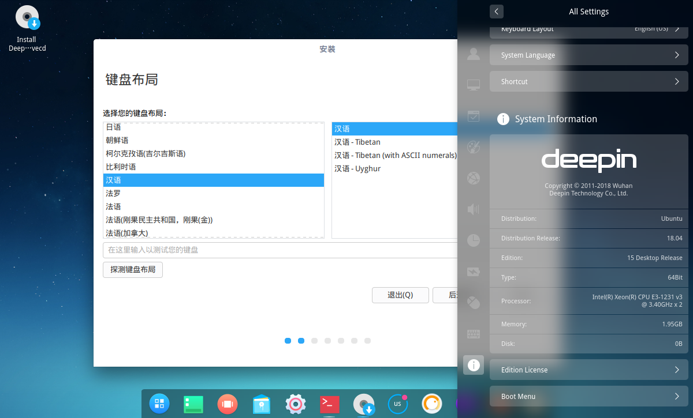

# ubuntu-deepin
Port Deepin Software on Ubuntu.

You can download lastest installer iso from
Ubuntu Bionic: https://drive.google.com/file/d/1xkQPb4tWocknuYeY-t41W--kz-9SSL0V/view?usp=sharing
> NOTE
> The installer desktop shortcut may not run by click
> Please run commands in terminal
> `sudo ubiquity gtkui`

## Getting help
Any usage issues can ask for help via

* [Gitter](https://gitter.im/orgs/linuxdeepin/rooms)
* [IRC channel](https://webchat.freenode.net/?channels=deepin)
* [Forum](https://bbs.deepin.org)
* [WiKi](https://wiki.deepin.org/)

